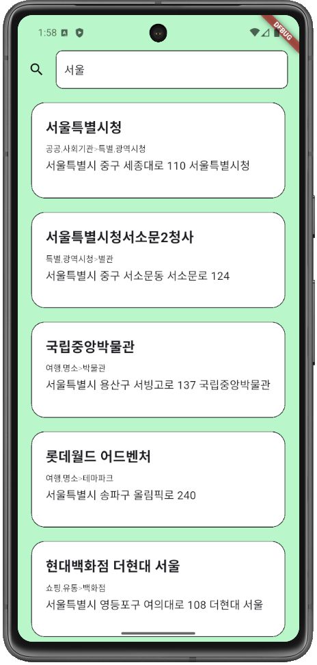

# 지역 검색 & 리뷰 앱

이 프로젝트는 **네이버 지역 검색 API**와 **Firebase**를 활용하여, 사용자가 지역을 검색하고 해당 위치에 대한 리뷰를 작성 및 확인할 수 있는 Flutter 애플리케이션입니다.

---

## 📱 앱 소개

- 사용자는 검색창에 키워드를 입력하여 지역 정보를 검색할 수 있습니다.
- 검색 결과 중 원하는 지역을 선택하면 해당 지역에 대한 리뷰 페이지로 이동합니다.
- 리뷰 페이지에서는 새로운 리뷰를 작성하거나 기존 리뷰를 확인할 수 있습니다.
- 모든 리뷰 데이터는 **Firebase Firestore**에 저장됩니다.

---

## 주요 기능

1. **지역 검색**
   - 네이버 검색 Open API를 활용하여 키워드 기반의 지역 검색 기능 제공
   - 검색 결과는 리스트 형태로 표시

2. **리뷰 작성 및 조회**
   - Firebase Firestore와 연동하여 선택한 지역의 리뷰를 작성 및 조회
   - 지역 좌표(MapX, MapY)에 기반하여 리뷰 데이터 관리

3. **데이터 실시간 반영**
   - Firestore 실시간 업데이트를 통해 리뷰 작성 후 즉시 반영

4. **MVVM 아키텍처 적용**
   - Riverpod을 사용한 상태 관리
   - Repository 패턴과 ViewModel 구조 설계

5. **API 연동 및 JSON 처리**
   - Dio 패키지를 이용한 HTTP 통신
   - JSON 데이터를 모델 객체로 변환하여 사용

---

## 기술 스택

- **Flutter**
- **Firebase Firestore**
- **Naver Open API**
- **HTTP 패키지**
- **JSON 데이터 파싱**
- **MVVM 아키텍처**
- **Riverpod 상태 관리**

---

## 사용 방법

1. **앱 실행**
   - 앱을 실행하면 상단 검색창이 표시됩니다.
   
2. **지역 검색**
   - 검색창에 원하는 지역 키워드를 입력 후 엔터 또는 검색 아이콘 클릭
   - 예: `서울`, `부산`, `samsung`

3. **검색 결과 확인**
   - 리스트에서 원하는 지역을 선택

4. **리뷰 작성**
   - 해당 지역 페이지에서 리뷰 작성 후 저장 버튼 클릭
   - 저장 즉시 리뷰 목록에 반영
   - 서울특별시청과 광안리해수욕장의 리뷰로 들어가보시면 제가 남긴 리뷰데이터가 존재합니다.

5. **리뷰 조회**
   - 이미 작성된 리뷰를 실시간으로 확인 가능

---

## 실행 화면

### 지역 검색

### 리뷰 작성

---

